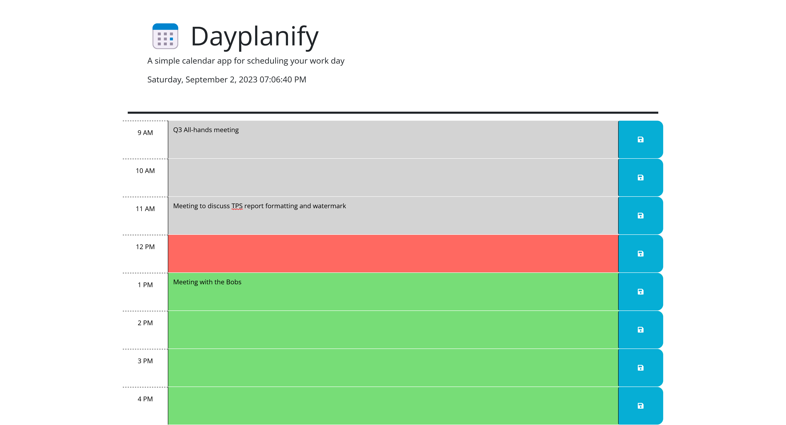

# dayplanify

A calendar application to help plan the workday.

## Description

Select a timeblock and save a note to self or reserve time for an event.

Utilizes [dayjs](https://day.js.org/) to handle conditional rendering according to the time of day. Built with jQuery and Bootstrap.

## Usage

Navigate to the [deployed application](https://r0b4dams.github.io/dayplanify/). Add text to an hour block and click the save icon to persist data.

## Technology

- JavaScript
- jQuery
- HTML
- CSS
- Bootstrap
- Webpack
